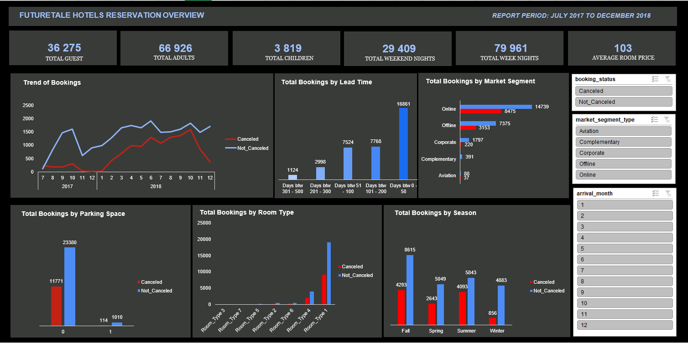

## EliteTale-Hotel
EliteTale Hotel is a Swedish hotel with state-of-the art guestrooms combine modern style and undeniable
comfort, with original artwork complementing the Swedish furnishings. The
muted colour schemes contrast with the city lights and skyscrapers in the
background. All of our rooms include LCD flat-screen televisions, wired or
wireless internet access, individual air conditioning control, an in-room
safe, complimentary tea and coffee making facilities, and luxurious
bathrobes and slippers.

The online hotel reservation channels have
dramatically changed booking possibilities and
customers’ behavior. A significant number of
hotel reservations are called-off due to
cancellations or no-shows. The typical reasons
for cancellations include change of plans,
scheduling conflicts, etc. This is often made
easier by the option to do so free of charge or
preferably at a low cost which is beneficial to
hotel guests but it is a less desirable and
possibly revenue-diminishing factor for hotels
to deal with.

I was employed as a Data
Analyst to explore the data and provide
some insights and recommendations?

**Insights**
From the data we were given, the Hotel had a total of 36,275 guests from the period under review. 66,926 were Adults while we had 3,819 children. 11,885 guest cancelled there booking while 24,390 were hosted by the Hotel.
The total number of days was 109,370 days with the total week nights accounting for 79,961 days (73.1%) of total duration. The weekend nights only had 29,409 days (26.9%) of total duration.
It was discovered that the average room price for the duration was £103
Contrary to popular opinion of there being more hotel guests in the summer, the data set shows that the Fall season of the year brought more guest (8615) with the Summer coming in second (5843), followed by the Spring (5049) and lastly the Winter (4883).
The total number of days was 109,370 days with the total week nights accounting for 79,961 days (73.1%) of total duration. The weekend nights only had 29,409 days (26.9%) of total duration.
The Online market segment broght in the largest amount of guest 14,739 followed by Offline guest at 7,375. Corporate guest came in third at 1,797, complimentary and Aviation guests came in 4th and 5th respectively with 391 and 88 guests.
November and December have the lowest amount of cancellations while October recorded the highest.
Lead time period of 0 - 50 days has the highest amount of guest at 46.5%
Winter has the lowest cancellation ratio with only 17,5% of guests cancelling while Summer has the highest at 70%.
Room type 1 is the most famous room with 78.5% of guest requesting it.

